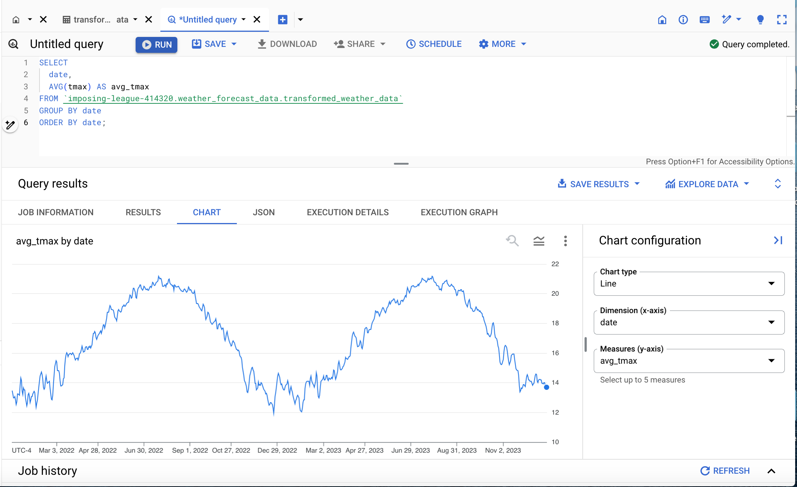

#### 1. Average Tmax by Date

**Query:**

The chart successfully visualizes the seasonal variations in daily average maximum temperature (TMAX), highlighting the expected increase during summer and decrease during winter

