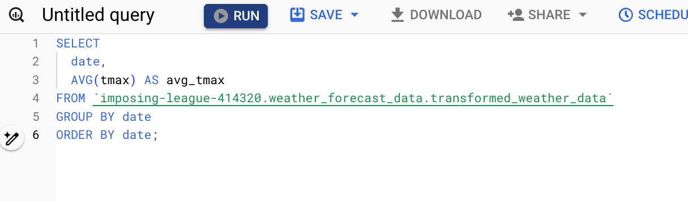
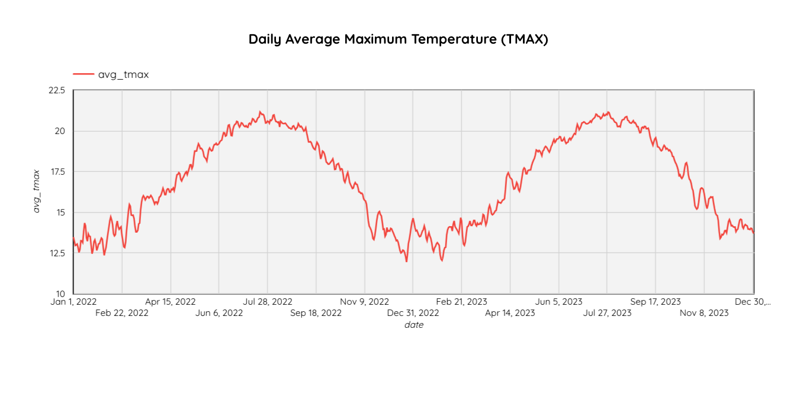

## Exploratory Data Analysis Visualizations

In this part, I will utilize Looker Studio to create visualizations from the weather data stored in BigQuery. Looker Studio provides a powerful interface for transforming raw data into insightful charts and graphs, making it easier to identify trends and patterns. 

#### 1. Average Max Temperature (Tmax) by Date

**Query:**

This cyclical trend highlights the predictable nature of temperature variations, which are crucial for developing accurate weather forecasting models. The data shows a clear increase in temperatures starting from late winter, reaching a peak in mid-summer, followed by a gradual decline as winter approaches again.
