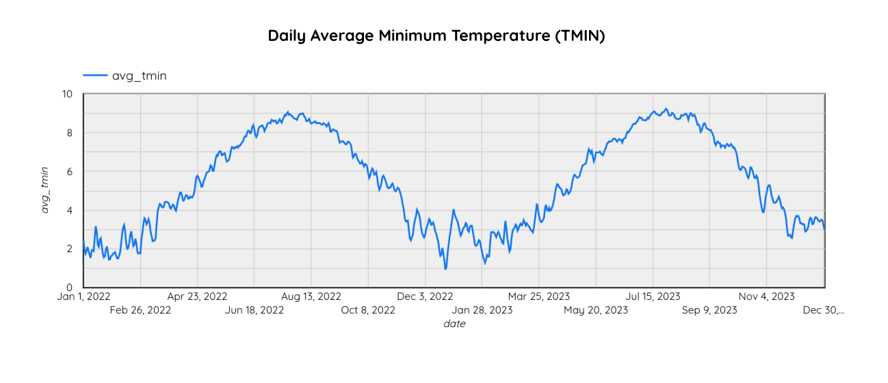
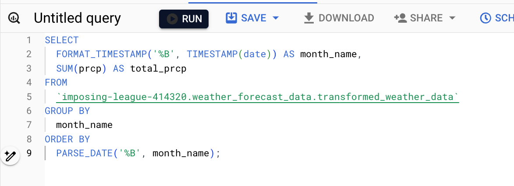
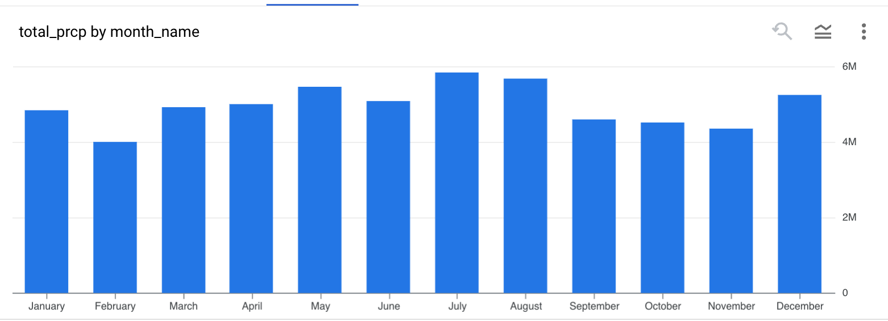
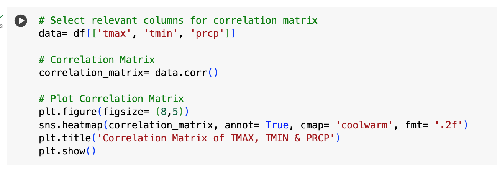
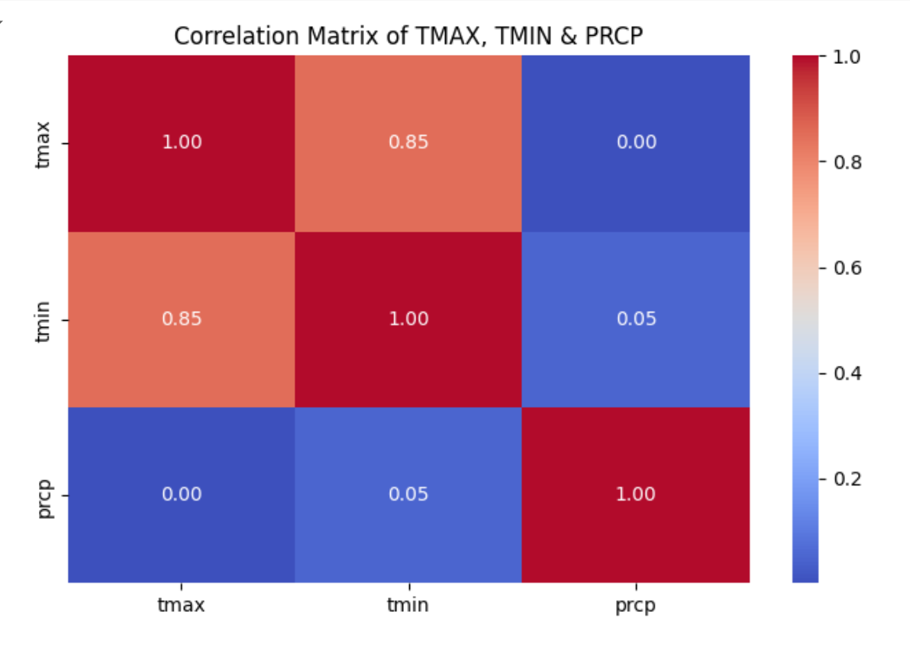
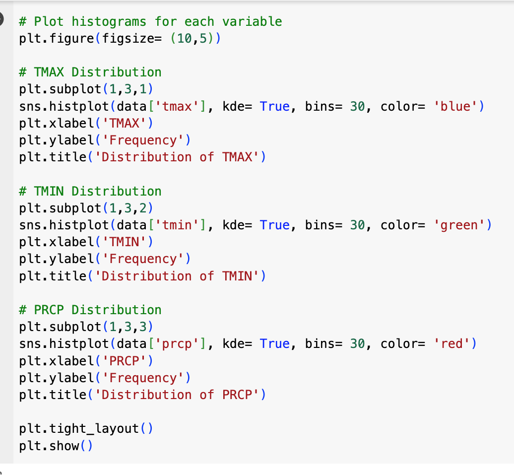
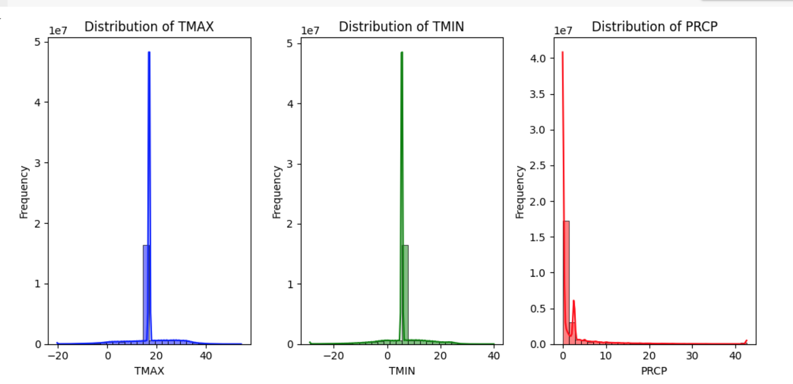

## Exploratory Data Analysis Visualizations

In this part, I will utilize Looker Studio, BiqQuery and Python Notebooks to create visualizations from the weather data stored in BigQuery. These tools provide a powerful interface for transforming raw data into insightful charts and graphs, making it easier to identify trends and patterns. 

#### 1. Average Max Temperature (Tmax) by Date

**Query:**

This cyclical trend highlights the predictable nature of temperature variations, which are crucial for developing accurate weather forecasting models. The data shows a clear increase in temperatures starting from late winter, reaching a peak in mid-summer, followed by a gradual decline as winter approaches again.

#### 2. Daily Average Minimum Temperature (TMIN)

**Query:**

The chart of the Daily Average Minimum Temperature (TMIN) exhibits clear seasonal trends similar to those observed in the maximum temperature chart. Minimum temperatures rise gradually from late winter to peak during the summer months and then decline as winter approaches. These cyclical patterns highlight the predictability of seasonal temperature changes, which is essential for developing robust weather forecasting models. The consistent troughs and peaks underscore the importance of incorporating seasonal variables in predictive analytics to improve the accuracy of forecasts.

#### 3. Daily Total Precipitation (PRCP) by Date

**Query:**

The data shows fluctuations with frequent peaks, indicating days of significant rainfall interspersed with periods of lower precipitation. This pattern underscores the episodic nature of precipitation, which is essential for understanding and predicting weather conditions.

#### 4. Monthly Average Maximum Temperature (TMAX)

**Query:**

Temperatures steadily rise from January, peaking during the summer months of July and August, and then gradually decrease towards October. This pattern aligns with typical seasonal variations, where the summer months exhibit the highest temperatures and the winter months the lowest. The data highlights the expected temperature fluctuations over the course of the year, providing valuable insights for forecasting and planning purposes.

#### 5. Monthly Average Minimum Temperature (TMIN)

**Query:**

The data shows a clear seasonal pattern, with the highest average minimum temperatures occurring in July and August, and the lowest in January and December. This trend indicates the expected temperature fluctuations across the year, with warmer summer months and colder winter months. This visualization helps understand the seasonal temperature variations.

#### 6. Monthly Total Precipitation (PRCP)

**Query:**

Notably, the chart reveals that precipitation levels are relatively consistent throughout the year, with peaks in July and December. The lowest precipitation is observed in February.

#### 7. Correlation Matrix of TMAX, TMIN & PRCP

**Python Code:**

PRCP shows almost no correlation with either TMAX (0.00) or TMIN (0.05), suggesting that precipitation levels do not significantly influence temperature extremes in this dataset.

#### 8. Distribution of Variables- TMAX, TMIN & PRCP

**Python Code:**

The distribution plots of TMAX, TMIN, and PRCP show distinct patterns in the data. TMAX (maximum temperature) and TMIN (minimum temperature) have narrow distributions centered around their respective means, indicating consistent temperature ranges with few extreme values. PRCP (precipitation) has a skewed distribution with a long tail, suggesting that most days have low precipitation, but there are occasional days with very high rainfall. These distributions highlight the relative stability in temperature data and the variability in precipitation.

