## BigQuery Analysis

This document details the exploration, preprocessing, and analysis of the GHCN-Daily weather data within BigQuery. The goal is to understand the data, identify relevant variables, and prepare it for feature engineering and model training.

### I- Initial Queries

#### 1. Retreiving Data from a Single Station

To understand the structure and content of the GHCN-Daily dataset, I start with some simple queries to retrieve data for a specific station. This will give me a feel for the available variables and their values.

**Query:**

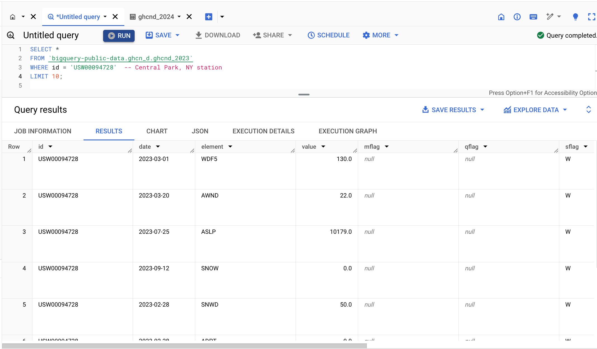

The results showcase various weather elements like wind direction (WDF5), average wind speed (AWND), snowfall (SNOW), and snow depth (SNWD) measured at different dates in 2023. Notably, some elements like snowfall and snow depth have zero values, suggesting no snowfall occurred on those specific dates. The query also includes mflag, qflag, and sflag columns, likely indicating measurement, quality, and source flags respectively, but these columns contain null values in the returned rows

#### 2. Filter for Specific Weather Elements

**Query:**

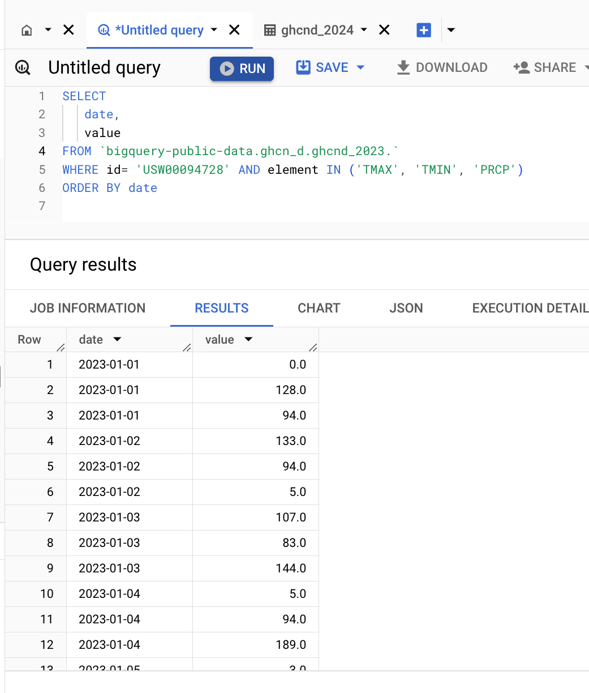

The result is a table sorted by date, where each date appears multiple times with different values corresponding to each weather element. Notably, the temperatures are presented in tenths of degrees Celsius (e.g., 128 represents 12.8 degrees Celsius). The data spans from January 1st to at least January 5th, 2023, and it reveals daily variations in weather conditions. For instance, on January 1st, the maximum temperature reached 12.8 degrees Celsius, while the minimum was 9.4 degrees Celsius, and there was no precipitation recorded. This filtered view provides a clearer understanding of the daily fluctuations in key weather parameters at the Central Park station throughout the early days of 2023.

#### 3. Exploring the Range of Values

**Query:**

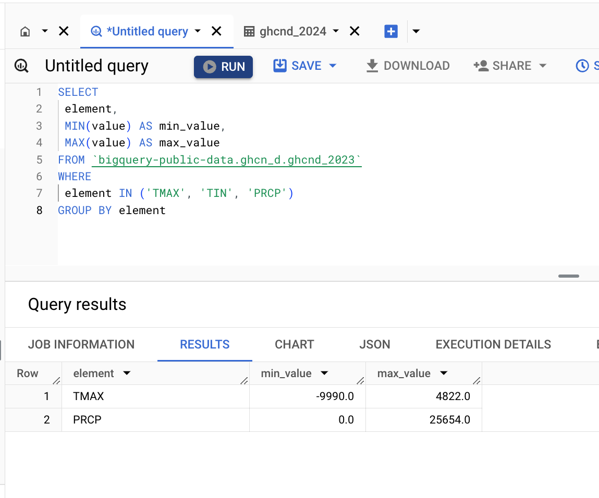

The query results reveal the minimum and maximum values for specific weather elements (TMAX, TMIN, PRCP) from the ghcnd_2023 table. The minimum temperature (TMIN) -9999.0, which is obviously an error or placeholder value. The maximum temperature (TMAX) is 482.2, which, when converted to Celsius (by dividing by 10), is 48.22 degrees Celsius. This could also be an error. The minimum precipitation (PRCP) is 0.0, which is expected as it represents days with no rain, while the maximum is 2565.4. While it is possible to have such high levels of rainfall in certain regions or during extreme events, it is worth further investigating this high value as a potential outlier.

#### 4. Identify Missing Data

**Query:**

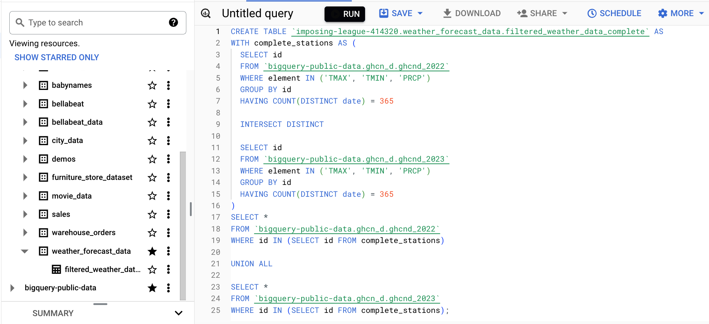

The query results indicate that, for a selection of stations (identified by id) and the specific weather element of precipitation (PRCP), there are no missing values within the ghcnd_2023 dataset. Each row represents a different station and shows the total number of PRCP records (total_rows) for that station throughout 2023, with the missing_rows column consistently showing 0. This suggests complete data collection for precipitation at these specific stations for the entire year of 2023.

#### 5. Check Station Overlap

**Query:**

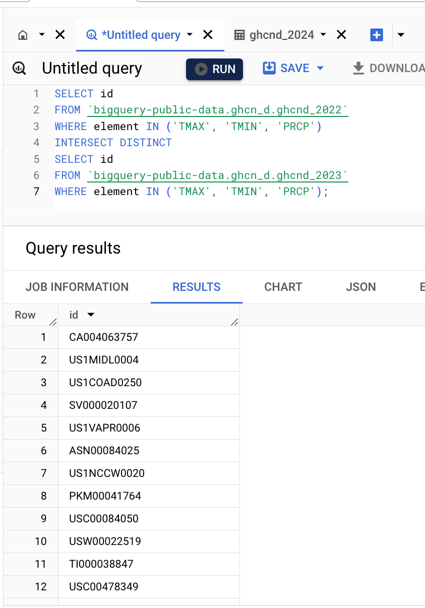

The query successfully identifies 12 weather stations that have data for the maximum temperature (TMAX), minimum temperature (TMIN), and precipitation (PRCP) in both 2022 and 2023. The station IDs are listed in the id column. This information can be used to refine future queries, ensuring that data from both years is available for analysis and model training.

#### 6. Create Filtered Table 

**Query:**

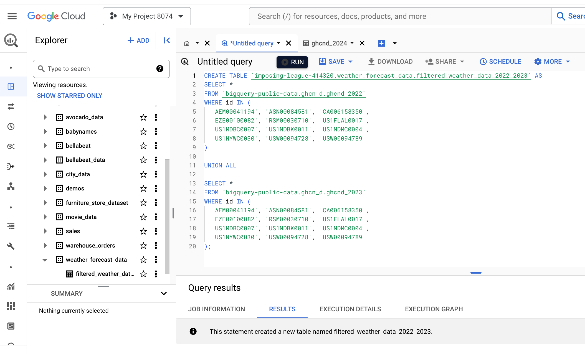

The table filtered_weather_data_2022_2023 within the weather_forecast_data dataset has been successfully created. This table consolidates daily weather observations from 12 stations across 2022 and 2023. The data is sourced from the ghcnd_2022 and ghcnd_2023 tables of the ghcn_d public dataset, filtering for stations with complete records for maximum temperature (TMAX), minimum temperature (TMIN), and precipitation (PRCP). This filtered table will serve as the foundation for subsequent data analysis, feature engineering, and model development.

#### 7. Distribution of Maximum Temperatures

**Query:**

The query results display the distribution of daily maximum temperatures (TMAX) in degrees Celsius for the year 2023 across the 12 selected weather stations. This initial exploration of the temperature distribution sets the stage for further analysis and lays the groundwork for our time series forecasting model.

#### 8. Temporal Trends in Maximum Temperatures

**Query:**

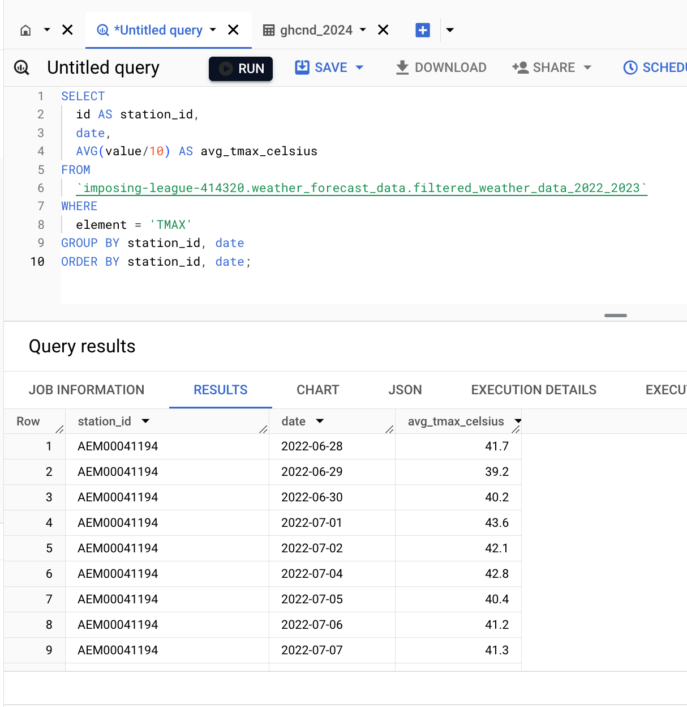

This analysis is important as it provides insights into the daily temperature variations at a specific location over a short timeframe.

#### 9. Date vs Average Max Temperatures Charts

**Query:**

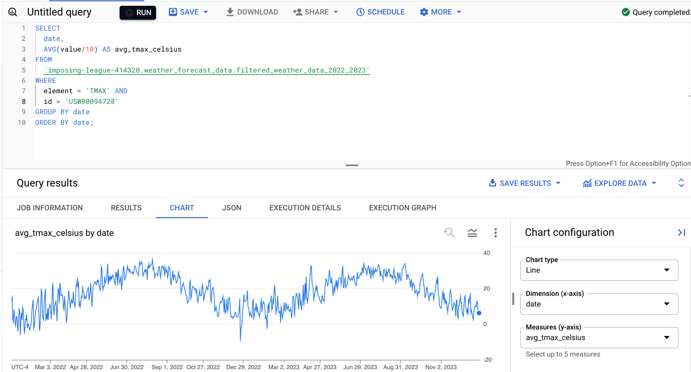

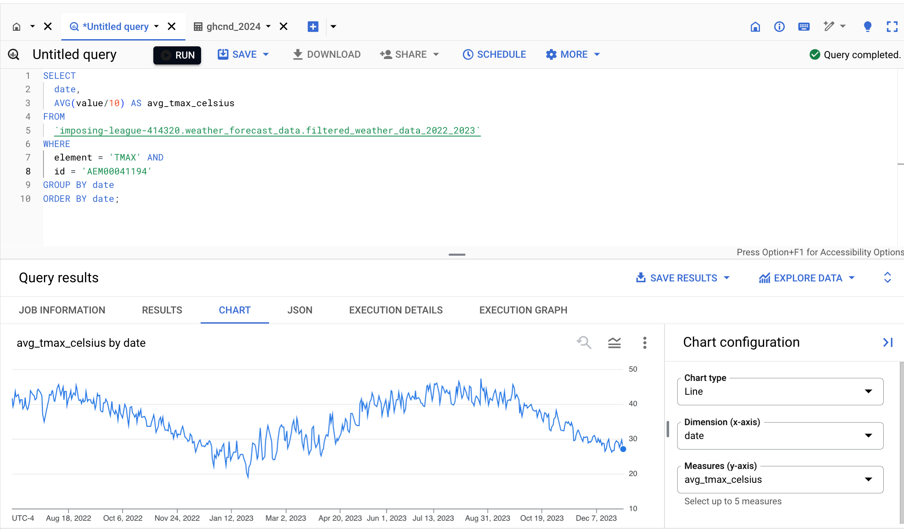

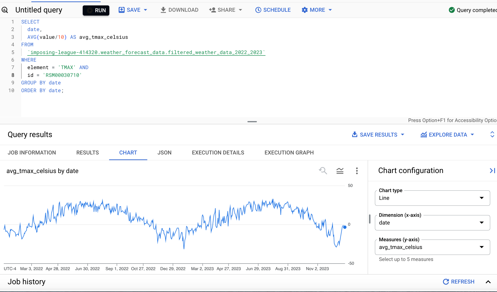

ASN00084581, and RSM00030710) reveals distinct patterns in average daily maximum temperatures over time. Station USW00094728 (New York) shows a clear seasonal pattern with higher temperatures in the summer and lower in the winter. Station ASN00084581 exhibits a similar seasonal pattern but with overall lower temperatures and a potential cooling trend over time. Station RSM00030710 also displays seasonality, but with a different pattern that might suggest a location in the Southern Hemisphere due to its peak temperatures occurring around December-January. These insights emphasize the importance of considering location and regional climate variations in weather analysis and forecasting.

#### 10. Distribution of Daily Minimum Temperatures

**Query:**

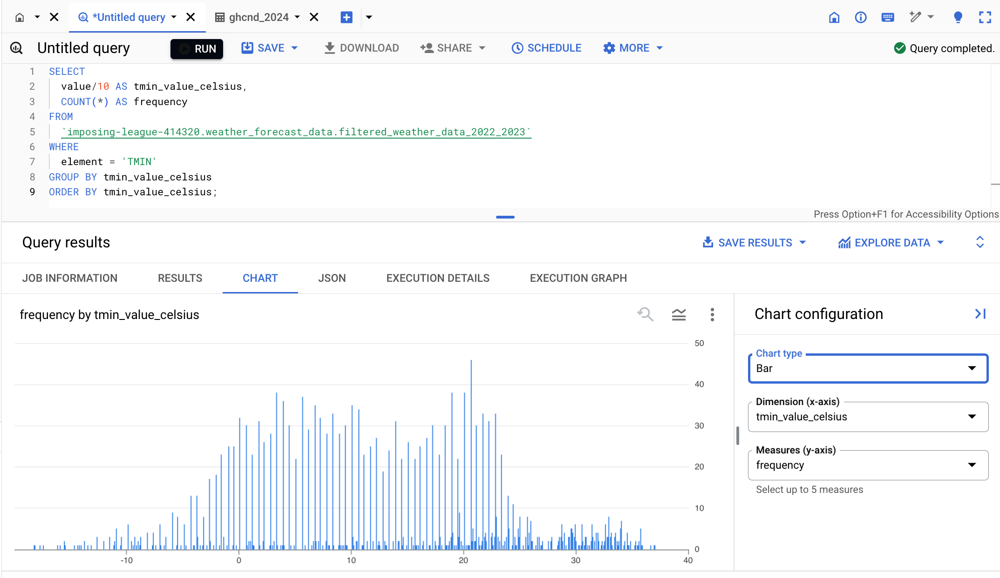

The histogram illustrates the distribution of daily minimum temperatures (TMIN) in degrees Celsius across the 12 selected weather stations for the year 2023. The x-axis represents the temperature values, and the y-axis represents the frequency of those values. The minimum temperatures range from approximately -10°C to 30°C. The distribution appears to be roughly bell-shaped (normal), with the majority of temperatures clustering between 0°C and 20°C. Many time series forecasting models assume that the underlying data follows a normal distribution. So, confirming this approximately normal distribution supports the use of the chosen model. 
