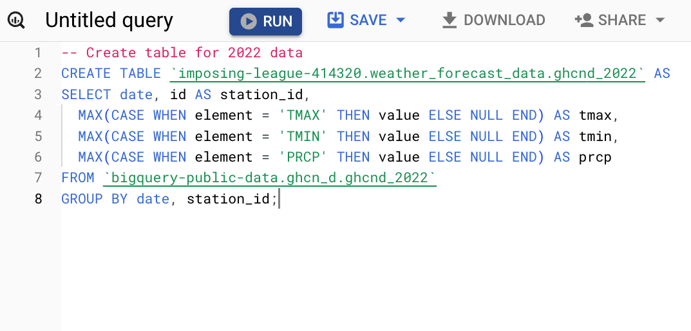
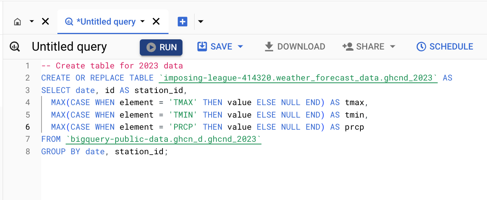
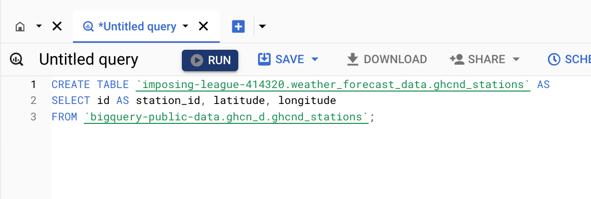
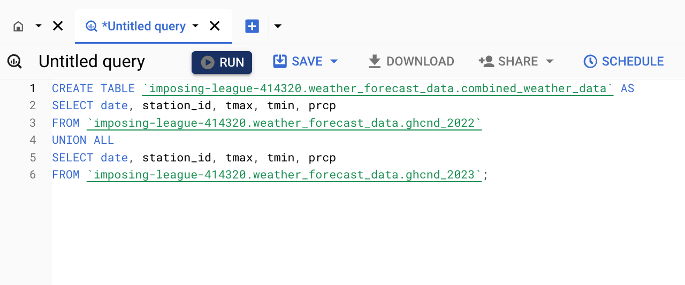
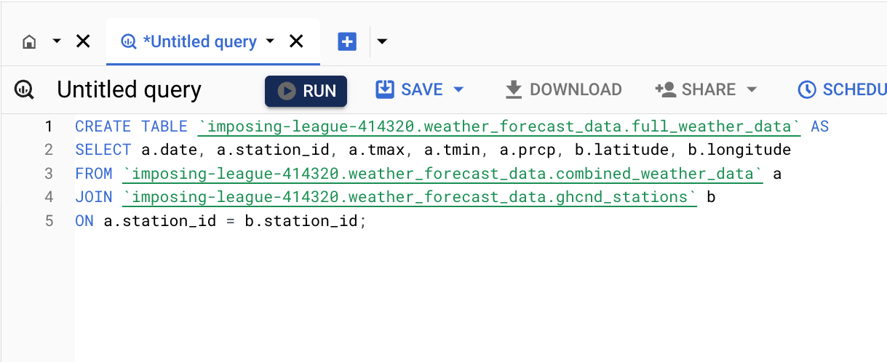
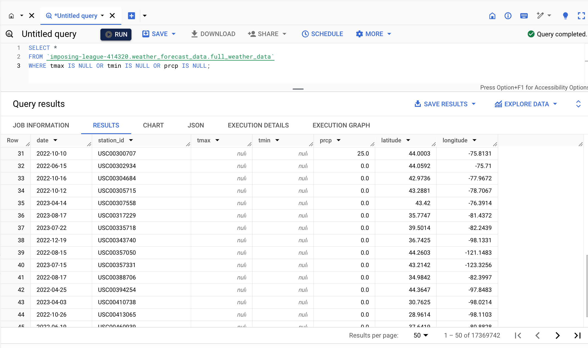
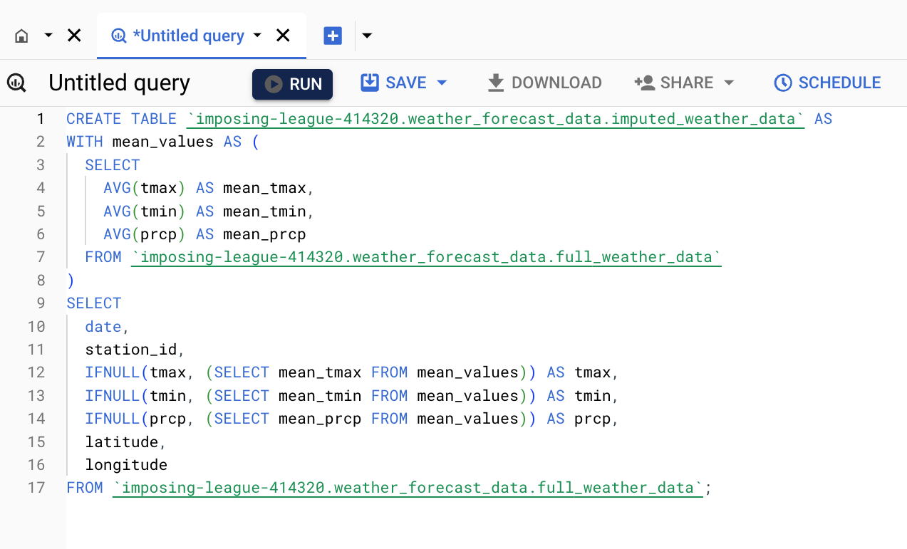
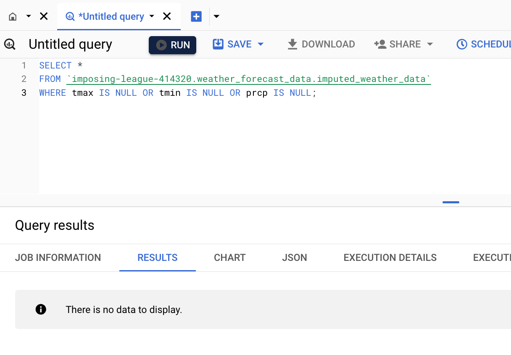

## BigQuery Analysis

This document details the exploration, preprocessing, and analysis of the GHCN-Daily weather data within BigQuery. The goal is to understand the data, identify relevant variables, and prepare it for feature engineering and model training.

#### 1. Create tables for 2022, 2023 & Stations Data

a) 2022 Table

**Query:**

b) 2023 Table

**Query:**

c) Stations

**Query:**

d) Combine data from 2022 and 2023

**Query:**

e) Join with Stations

**Query:**

#### 2. Data Preprocessing & Cleaning

a) Identify Missing Values

**Query:**

a.1) New Table with Imputed Values

**Query:**

a.2) Verify New Table

**Query:**

